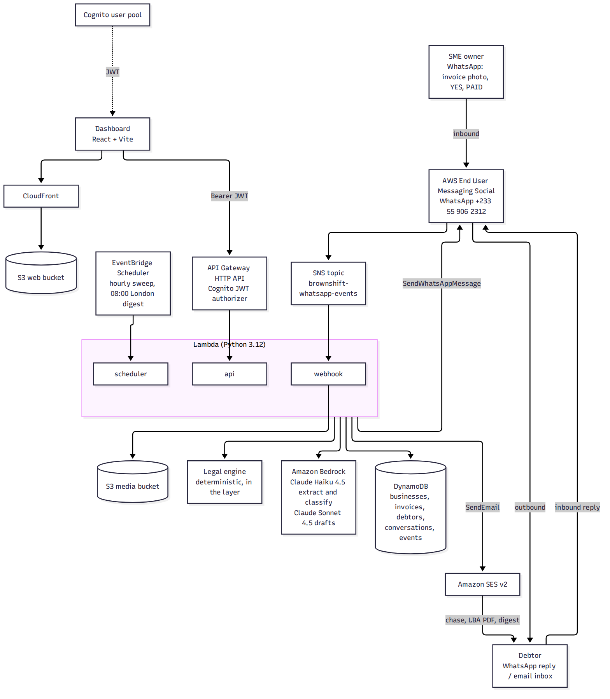

# Arrearo

**The credit controller that chases your late invoices on WhatsApp and adds the interest you are legally owed.**

Arrearo is a deployed AWS product for UK small businesses. The owner sends a photo of an invoice on WhatsApp. An agent reads it, tracks it, and chases the debtor when it goes late. Every chase cites the statutory interest and the legal basis. Replies are understood. Old debts get a Letter Before Action.

Built for the AWS CDS Agentic AI hackathon. Live on AWS account 854924711083, region us-east-1.

| | |
|---|---|
| Dashboard | https://d9gwfmvszoiw2.cloudfront.net |
| API | https://hppo19gaaf.execute-api.us-east-1.amazonaws.com |
| WhatsApp | +233 55 906 2312 |
| Stack | `arrearo`, us-east-1 |
| Demo login | `owner@arrearo.com` / `Arrearo-Demo-7391!Kq` |

Submission: [Devpost write-up](submission/DEVPOST.md) · [Technical deep-dive](submission/TECHNICAL.md)

## The problem

Late payment hurts UK small businesses, and most owners do nothing about it.

- The Department for Business and Trade says late payment costs the UK economy £11bn a year and shuts down 38 businesses every day (press release, 30 July 2025).
- The 38 a day comes from DBT and London Economics research (July 2025): about 14,000 additional closures a year. It is a modelled estimate.
- The same research finds over 1.5m businesses, 28% of all UK businesses, are affected each year. About £26bn is owed late at any given time.
- The average affected business is owed about £17,000.
- Affected businesses spend about 86 hours a year chasing.

Chasing is awkward, slow and done by the owner at night. Most owners also do not know the law lets them add interest and a fixed sum to a late commercial debt. They almost never do.

## The solution

Arrearo does the credit control, on the channel the debtor actually answers.

- **WhatsApp first.** The UK incumbents we checked (Chaser, Satago, Kolleno, Upflow) sell email, SMS, phone and letters. A text search of their home, pricing and feature pages found no WhatsApp.
- **Statute aware.** Arrearo works out interest at 8% over the Bank of England base rate, plus the fixed recovery sum, and puts both in every chase.
- **A real legal engine.** The numbers and the compliance checks are plain tested code. The language model never decides what is owed.
- **A debtor data asset.** Each debtor is scored from the UK government payment-practices data, and Arrearo logs payment behaviour as it runs.

Positioning: get paid on WhatsApp, with the statutory interest already added.

## How it works

1. **Capture.** The owner WhatsApps a photo of an invoice to Arrearo.
2. **Extract.** Claude Haiku 4.5 on Amazon Bedrock reads it into structured fields. It never invents an amount. Unsure fields are flagged.
3. **Confirm.** Arrearo replies with what it read and the date the debt becomes legally late. The owner replies YES.
4. **Track.** The invoice appears in the dashboard with interest accruing daily and the legal basis shown. The debtor is scored from payment-practices data. Unknown debtors stay unknown.
5. **Chase.** When the debt is late, the legal engine produces the facts. Claude Sonnet 4.5 phrases the message around them. A compliance scan checks it. Then it goes out by WhatsApp or email.
6. **Reply.** The debtor's answer is classified: promise to pay, dispute, not received, paid, question, other. The invoice status and timeline update. Promised dates are tracked.
7. **Escalate.** Old debts get a Letter Before Action: drafted, checked against the Pre-Action Protocol fields, rendered to PDF and emailed.
8. **Digest.** Every morning at 08:00 London time the owner gets a summary.

## Architecture

Serverless, in one SAM stack. Full detail and diagram in [submission/TECHNICAL.md](submission/TECHNICAL.md).



- **AWS End User Messaging Social** receives and sends WhatsApp.
- **Amazon SNS** carries inbound WhatsApp events.
- **AWS Lambda** (Python 3.12): `webhook`, `api`, `scheduler`, plus a shared layer holding the legal engine, agent code and CDS wrappers.
- **Amazon Bedrock**: Claude Haiku 4.5 for extraction and classification, Claude Sonnet 4.5 for drafting.
- **Amazon SES v2** sends email and the LBA PDF.
- **Amazon DynamoDB**: businesses, invoices, debtors, conversations, events.
- **Amazon S3**: inbound invoice media, and the dashboard build.
- **Amazon CloudFront** serves the dashboard.
- **Amazon API Gateway** (HTTP API) with a **Cognito** JWT authorizer.
- **Amazon EventBridge Scheduler**: hourly due sweep, daily digest.

## CDS services called at runtime

This is the hackathon's hard requirement. These calls are made by the deployed Lambdas, not by a script.

| Service | Call | Where |
|---|---|---|
| AWS End User Messaging Social | `SendWhatsAppMessage` | `send_whatsapp_text()` in `services/layer/python/common/cds.py` |
| AWS End User Messaging Social | `GetWhatsAppMessageMedia` | `fetch_whatsapp_media()` in the same file |
| Amazon SES v2 | `SendEmail` (with PDF attachment for the LBA) | `send_email()` in the same file |
| Amazon Bedrock | `Converse` | `services/layer/python/agent/llm.py` |

`common/cds.py` creates `boto3.client("socialmessaging")` and `boto3.client("sesv2")` and makes the calls. Nothing else in the codebase talks to WhatsApp or email. The three Lambdas reach it through `common/flows.py`. IAM for each call is in `infra/template.yaml`.

Inbound WhatsApp arrives through the same service: the SNS topic `brownshift-whatsapp-events` triggers `services/functions/webhook.py`, which fetches invoice photos with `GetWhatsAppMessageMedia`.

By default the stack runs with `SendMode=dry`. See Known limitations.

## The legal engine

`services/layer/python/legal/engine.py` is the moat. It is deterministic Python, with tests in `legal/test_engine.py`. The model never produces an amount, a date or a verdict.

- **Statutory interest:** 8% over the Bank of England base rate, computed in `Decimal`, in whole pence, rounded half up. The code holds a dated base rate of 3.75%, which gives 11.75% a year.
- **Fixed recovery sum:** £40 under £1,000, £70 from £1,000 to £9,999.99, £100 from £10,000.
- **Legally late date:** an agreed due date wins. Otherwise 30 days for a public authority, 60 days for a business, from the later of invoice or delivery. With no terms, 30 days.
- **Compliance scan:** blocks drafts that imply criminal proceedings, claim false authority or look like an official document, in line with the Administration of Justice Act 1970 section 40.
- **Contact cadence:** a minimum gap between contacts per stage.
- **LBA fields:** the Pre-Action Protocol for Debt Claims checklist.

The facts go into the prompt. The model phrases them. The reply must cite the total owed and the original amount, or it is rejected. A draft that fails the scan is redrafted once, then blocked, logged and shown to the owner.

## Debtor intelligence

`services/debtors/` holds a subset of 400 companies from the UK government payment-practices data (Check when large businesses pay their suppliers). For each it keeps average days to pay, share paid within 30 days, share paid late, and a risk band. A lookup returns that record or `unknown`. It never guesses.

The longer-term asset is behavioural. Arrearo records every chase, reply and payment per debtor on the invoice timeline. Across many creditors, that becomes a view of who pays and when. Today the record is stored per invoice. The cross-customer score is the roadmap, and it needs consent and data-protection design first.

## Deploy

Needs the AWS SAM CLI, Python 3.12, Node, and AWS credentials for the target account.

```bash
# backend: build and deploy the stack (sends stay dry)
infra/deploy.sh

# turn real WhatsApp and SES sends on
infra/deploy.sh SendMode=live

# seed a demo business and four invoices
python infra/seed.py --sub <cognito user sub> --email owner@arrearo.com

# dashboard: build, then sync to the web bucket and invalidate CloudFront
cd web && npm install && npm run build
aws s3 sync dist/ s3://<WebBucket output> --delete
aws cloudfront create-invalidation --distribution-id <WebDistributionId output> --paths '/*'
```

`infra/deploy.sh` prints the stack outputs (`ApiUrl`, `WebUrl`, `WebBucket`, `WebDistributionId`, Cognito ids). Dashboard env vars are baked in at build time: `VITE_API_URL`, `VITE_COGNITO_REGION`, `VITE_COGNITO_CLIENT_ID`. Use `VITE_DEMO=1 npm run dev` for a seeded local preview with no login.

Tests: `pytest` from the project root.

## Known limitations

We would rather you hear these from us.

- **No custom domain.** Registering `arrearo.com` failed. A hold on Route 53 Domains on the AWS account blocks it, and it needs AWS Support. The app runs on its CloudFront and API Gateway URLs.
- **SES send is verified and proven.** Arrearo calls SES `SendEmail` at runtime, and a live send has been confirmed (a real message, MessageId returned) from the verified sender `billing@kasamafo.africa` (DKIM SUCCESS). `arrearo.com` could not be registered (an AWS account hold), so the verified sender is on `kasamafo.africa` for now. The account is still in the SES sandbox, so live recipients must be verified; the stack defaults to `SendMode=dry` and is switched on with `SendMode=live`.
- **WhatsApp cold contact needs a Meta template.** WhatsApp only allows free-form messages inside 24 hours of the other party's last message. A first message to a debtor needs a Meta-approved template. Approval is a long-lead step outside the AWS API, and we have none yet. Replies inside the window work. The demo is driven by inbound messages, where the owner's photo opens the window.
- **SendMode is `dry` by default.** In dry mode a send returns `sent:false, dryRun:true` and nothing leaves AWS. Deploy with `SendMode=live` to send for real.
- **Base rate is a dated constant.** The engine holds the Bank of England rate as a constant with an as-of date. It does not fetch it live.
- **Debtor data is a subset.** 400 companies, not the full dataset. Anyone else is `unknown`.
- **Not legal advice.** Arrearo assists with credit control. Whether and when to send a Letter Before Action is the owner's call.

## AI disclosure

- **At runtime,** Arrearo's agent reasons with Anthropic Claude on Amazon Bedrock. Claude Haiku 4.5 reads invoices and classifies replies. Claude Sonnet 4.5 drafts chases, Letters Before Action and digests. Amounts, dates and interest are never produced by the model. They come from the deterministic legal engine.
- **At build time,** this codebase was written with AI assistance (Claude Code) under human direction. A human set the product, made the decisions, and reviewed and deployed the result.

## Repository layout

```
infra/       SAM template, deploy script, seed
services/    functions (webhook, api, scheduler), layer (legal, agent, common), debtors, tests
web/         React + Vite dashboard
submission/  Devpost write-up, technical deep-dive, architecture diagram, images
```

## Licence

MIT. See [LICENSE](LICENSE).
