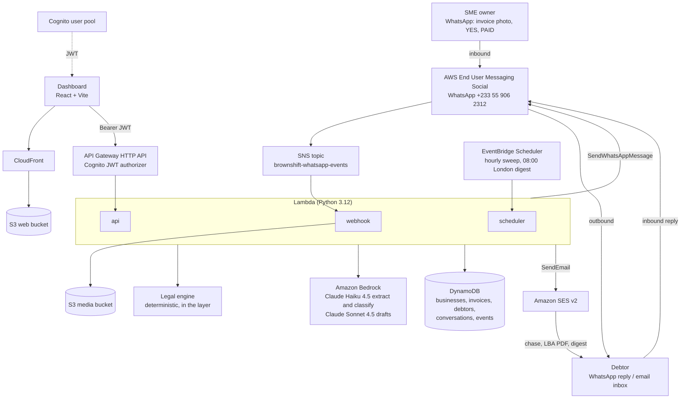

# Arrearo architecture

Arrearo is serverless on AWS, in `us-east-1`, as one SAM stack named `arrearo` (`infra/template.yaml`). There are no servers to run. Every part scales to zero.

## The flow

A rendered copy is at `docs/architecture.png`.

## Inbound: WhatsApp to invoice

1. The owner sends a photo of an invoice to the Arrearo WhatsApp number.
2. AWS End User Messaging Social publishes the event to the SNS topic `brownshift-whatsapp-events`.
3. The `arrearo-webhook` Lambda is subscribed. It decodes the payload twice (the entry is JSON inside JSON), normalises the sender to E.164, and ignores repeats of the same message id.
4. For an image it calls `GetWhatsAppMessageMedia`, which writes the file to the media bucket. The Lambda reads it back.
5. Claude Haiku 4.5 on Bedrock reads the image and returns structured fields (`agent/extract.py`). It never invents an amount. Low confidence is flagged to the owner.
6. The legal engine works out the date the debt becomes legally late. The reply to the owner says what Arrearo read and asks for YES.
7. YES confirms the invoice. The debtor is scored against the payment-practices subset. Unknown stays unknown.

If the sender is not an owner but a debtor with an open invoice, the same Lambda classifies the reply (`agent/classify.py`): promise to pay, dispute, not received, paid, question or other. It updates the invoice status and writes a timeline event.

## Outbound: chase, reply, letter before action

Every outbound message follows one path in `services/layer/python/common/flows.py`:

1. The legal engine produces the facts: original amount, days late, rate, interest to date, fixed sum, total owed.
2. Claude Sonnet 4.5 phrases a message around those facts. It does not calculate them.
3. `compliance_scan` checks the draft. A draft that implies criminal action, false authority or official styling is redrafted once, then blocked and logged as a `compliance_block` event.
4. `can_contact_now` enforces a minimum gap between contacts.
5. `common/cds.py` makes the call: `SendWhatsAppMessage` or SES `SendEmail`.

The Letter Before Action is drafted the same way, rendered to PDF (`common/pdf.py`), and sent as an SES attachment with the Pre-Action Protocol checklist alongside.

## Dashboard path

The React app is built to `web/dist`, synced to a private S3 bucket and served by CloudFront with origin access control. Routing is hash-based, so deep links work without rewrite rules. The app signs in with Cognito (`USER_PASSWORD_AUTH`) and calls the HTTP API with the ID token. The JWT authorizer sits on API Gateway. See `docs/API.md` for routes.

## Scheduled work

EventBridge Scheduler invokes `arrearo-scheduler` two ways:

- Hourly: the due sweep. Moves confirmed invoices to due, then chases anything late whose cadence allows.
- Daily at 08:00 Europe/London: the owner digest.

## Data

Five DynamoDB tables, on-demand billing. Money is stored as integer pence. Derived values (days late, interest, total owed) are computed at read time by the legal engine, so they are never stale.

| Table | Holds |
|---|---|
| businesses | The SME account, WhatsApp number, bank details for letters |
| invoices | Extracted and confirmed invoices, status, legally late date |
| debtors | Payment-practices record and risk band per debtor |
| conversations | WhatsApp messages in and out, intent, 24 hour window |
| events | Audit timeline per invoice |

## Components

| Component | Role |
|---|---|
| `services/functions/webhook.py` | WhatsApp inbound, owner and debtor flows |
| `services/functions/api.py` | Dashboard API |
| `services/functions/scheduler.py` | Due sweep and digest |
| `services/layer/python/legal/engine.py` | Statutory interest, late date, fixed sum, compliance, LBA fields |
| `services/layer/python/agent/` | Bedrock calls: extract, classify, draft |
| `services/layer/python/common/cds.py` | The CDS calls: WhatsApp and SES |
| `services/debtors/` | Debtor lookup from the payment-practices subset |
| `web/` | React dashboard |
| `infra/template.yaml` | The whole stack |

## IAM

Least privilege, scoped per function in the template: `bedrock:InvokeModel` on the two inference profiles, `social-messaging:SendWhatsAppMessage` on the phone number resource, `ses:SendEmail` and `ses:SendRawEmail` on SES identities, and DynamoDB access to the stack's own tables.

## Rendering this diagram

The Mermaid source above renders on GitHub. To produce a PNG locally: `npx -y @mermaid-js/mermaid-cli -i <diagram>.mmd -o docs/architecture.png`.
